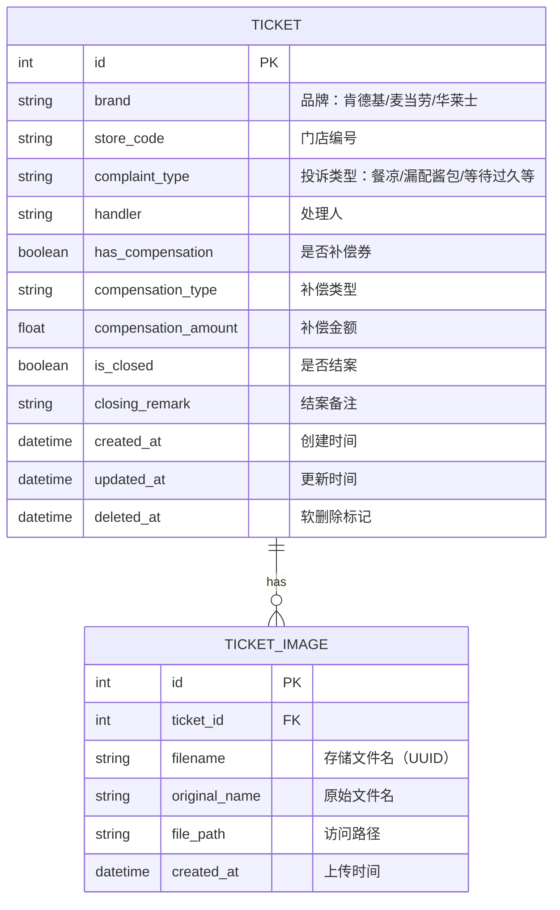

# 400热线工单管理系统

Vue 3 + FastAPI + SQLite 构建的餐饮品牌投诉工单管理系统，解决纸质台账搜索难、复盘效率低的问题。

## 功能特性

- **工单管理**：记录肯德基、麦当劳、华莱士等品牌的投诉工单
- **字段完整**：品牌、门店编号、投诉类型、处理人、是否补偿券、结案备注
- **图片附件**：支持多图上传，存储于本地卷
- **分页列表**：按创建日期倒序排列，支持分页浏览
- **筛选功能**：按品牌筛选、按结案状态筛选
- **软删除**：删除操作仅标记 `deleted_at`，数据可恢复
- **表单校验**：补偿金额 > 0 时必须选择补偿类型（前后端双重校验）
- **OpenAPI 文档**：自动生成交互式 API 文档

## 技术栈

| 层级 | 技术 | 版本 |
|------|------|------|
| 前端 | Vue 3 + Vite | ^3.4.0 |
| UI 组件 | Element Plus | ^2.5.0 |
| HTTP 客户端 | Axios | ^1.6.5 |
| 后端 | FastAPI | ^0.109.0 |
| ORM | SQLAlchemy | ^2.0.25 |
| 数据校验 | Pydantic | ^2.5.3 |
| 数据库 | SQLite | - |
| 容器化 | Docker + docker-compose | - |

## 项目结构

```
tl-0055-1/
├── backend/                    # FastAPI 后端
│   ├── app/
│   │   ├── __init__.py
│   │   ├── main.py            # 应用入口 + API 路由
│   │   ├── models.py          # SQLAlchemy 数据模型
│   │   ├── schemas.py         # Pydantic 数据校验
│   │   ├── crud.py            # 数据库操作
│   │   └── database.py        # 数据库连接配置
│   ├── uploads/               # 图片上传目录（挂载卷）
│   ├── tickets.db             # SQLite 数据库文件
│   ├── requirements.txt
│   └── Dockerfile
├── frontend/                   # Vue 3 前端
│   ├── src/
│   │   ├── components/
│   │   │   └── TicketList.vue # 工单列表组件
│   │   ├── utils/
│   │   │   └── api.js         # API 接口封装
│   │   ├── App.vue
│   │   └── main.js
│   ├── index.html
│   ├── vite.config.js
│   ├── package.json
│   └── Dockerfile
├── docker-compose.yml
├── .env.example
├── .gitignore
└── README.md
```

## ER 图



### 表结构说明

**tickets 工单表**
- `id`: 主键，自增
- `brand`: 品牌名称，非空，建立索引
- `store_code`: 门店编号，非空，建立索引
- `complaint_type`: 投诉类型，非空
- `handler`: 处理人，非空
- `has_compensation`: 是否有补偿，默认 false
- `compensation_type`: 补偿类型（优惠券、代金券、退款、赠品、其他）
- `compensation_amount`: 补偿金额，默认 0.0
- `is_closed`: 是否已结案，默认 false
- `closing_remark`: 结案备注
- `created_at`: 创建时间，默认当前时间
- `updated_at`: 更新时间，自动更新
- `deleted_at`: 软删除标记，null 表示未删除

**ticket_images 工单图片表**
- `id`: 主键，自增
- `ticket_id`: 外键，关联工单
- `filename`: UUID 生成的存储文件名，避免冲突
- `original_name`: 用户上传的原始文件名
- `file_path`: 静态文件访问路径（/uploads/xxx.jpg）
- `created_at`: 上传时间

## 快速开始

### 方式一：Docker Compose（推荐）

```bash
# 克隆项目后进入目录
cd tl-0055-1

# 复制环境变量配置
cp .env.example .env

# 启动所有服务
docker-compose up -d --build

# 查看服务状态
docker-compose ps

# 查看日志
docker-compose logs -f backend
docker-compose logs -f frontend

# 停止服务
docker-compose down
```

访问地址：
- 前端: http://localhost:5173
- 后端 API: http://localhost:8000
- OpenAPI 文档: http://localhost:8000/docs

### 方式二：本地开发

**启动后端：**
```bash
cd backend
pip install -r requirements.txt
python -m uvicorn app.main:app --host 0.0.0.0 --port 8000 --reload
```

**启动前端：**
```bash
cd frontend
npm install
npm run dev
```

## API 接口

### 工单管理

| 方法 | 路径 | 说明 |
|------|------|------|
| GET | `/tickets` | 获取工单列表（分页、筛选） |
| GET | `/tickets/{id}` | 获取工单详情 |
| POST | `/tickets` | 创建工单 |
| PUT | `/tickets/{id}` | 更新工单 |
| DELETE | `/tickets/{id}` | 软删除工单 |
| POST | `/tickets/{id}/images` | 上传工单图片 |

### 基础数据

| 方法 | 路径 | 说明 |
|------|------|------|
| GET | `/brands` | 获取品牌列表 |
| GET | `/complaint-types` | 获取投诉类型列表 |
| GET | `/compensation-types` | 获取补偿类型列表 |

### 列表筛选参数

```
GET /tickets?page=1&page_size=10&brand=肯德基&is_closed=false
```

- `page`: 页码，默认 1
- `page_size`: 每页数量，默认 10，最大 100
- `brand`: 品牌筛选（肯德基/麦当劳/华莱士）
- `is_closed`: 结案状态筛选（true/false）

### 数据校验规则

**后端校验（Pydantic）：**
```python
@model_validator(mode='after')
def check_compensation_type_when_amount_positive(self):
    if self.compensation_amount > 0 and not self.compensation_type:
        raise ValueError('补偿金额大于0时必须选择补偿类型')
    return self
```

**前端校验（Element Plus）：**
```javascript
const validateCompensationType = (rule, value, callback) => {
  if (ticketForm.has_compensation && 
      ticketForm.compensation_amount > 0 && 
      !ticketForm.compensation_type) {
    callback(new Error('补偿金额大于0时必须选择补偿类型'))
  } else {
    callback()
  }
}
```

## Volumes 挂载

docker-compose 配置了 `uploads` 命名卷，用于持久化存储上传的图片文件：

```yaml
services:
  backend:
    volumes:
      - uploads:/app/uploads

volumes:
  uploads:
```

**卷备份：**
```bash
# 备份 uploads 卷
docker run --rm -v tl-0055-1_uploads:/data -v $(pwd):/backup alpine tar cvf /backup/uploads.tar /data

# 恢复 uploads 卷
docker run --rm -v tl-0055-1_uploads:/data -v $(pwd):/backup alpine tar xvf /backup/uploads.tar -C /
```

## 软删除机制

删除操作不会物理删除数据，而是设置 `deleted_at` 字段：

```python
def soft_delete_ticket(db: Session, ticket_id: int):
    db_ticket = get_ticket(db, ticket_id)
    if not db_ticket:
        return None
    db_ticket.deleted_at = datetime.utcnow()
    db.commit()
    return db_ticket
```

查询时自动过滤已删除数据：
```python
query = db.query(models.Ticket).filter(models.Ticket.deleted_at.is_(None))
```

**恢复已删除数据：**
```sql
UPDATE tickets SET deleted_at = NULL WHERE id = {ticket_id};
```

## OpenAPI 文档

FastAPI 自动生成交互式 API 文档：

- **Swagger UI**: http://localhost:8000/docs
- **ReDoc**: http://localhost:8000/redoc
- **OpenAPI JSON**: http://localhost:8000/openapi.json

## 开发规范

- 代码风格：Python 遵循 PEP 8，JavaScript 遵循 ESLint（Vue 推荐）
- 数据库迁移：SQLite 采用 `Base.metadata.create_all()` 自动建表
- 静态文件：上传的图片通过 `/uploads/{filename}` 直接访问
- CORS：允许所有来源跨域访问（生产环境需调整）

## 常见问题

**Q: 上传图片失败怎么办？**
- 检查 `uploads` 目录是否存在且有写入权限
- 检查文件大小是否超过 10MB 限制
- 确认文件类型为图片格式

**Q: 数据库数据如何备份？**
```bash
# 备份 SQLite 数据库
cp backend/tickets.db tickets.backup.db

# 恢复数据库
cp tickets.backup.db backend/tickets.db
```

**Q: 如何添加新的品牌或投诉类型？**
- 修改 `backend/app/main.py` 中的对应接口返回值
- 如需要持久化存储，可新增字典表

## License

MIT
